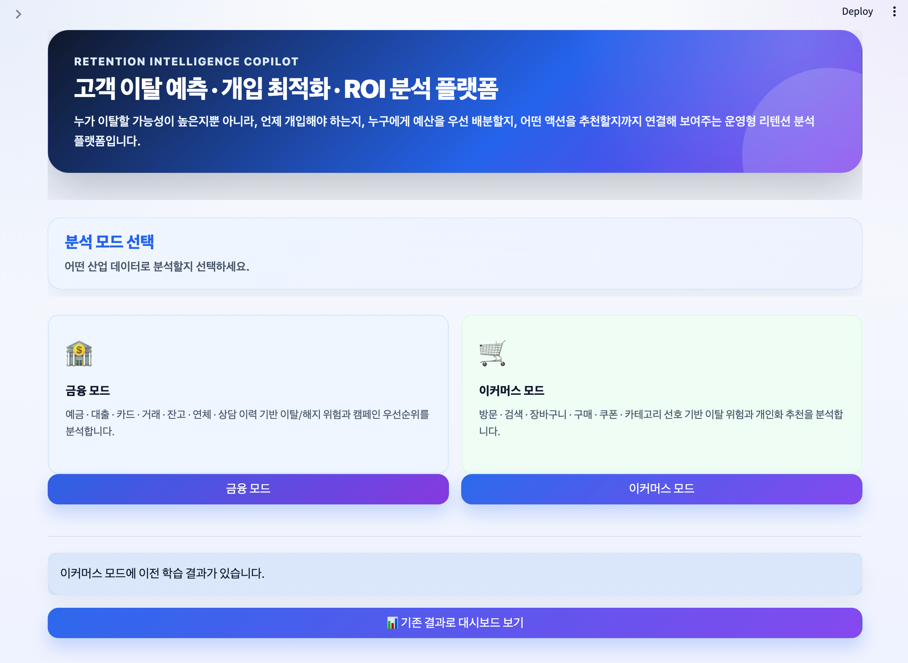
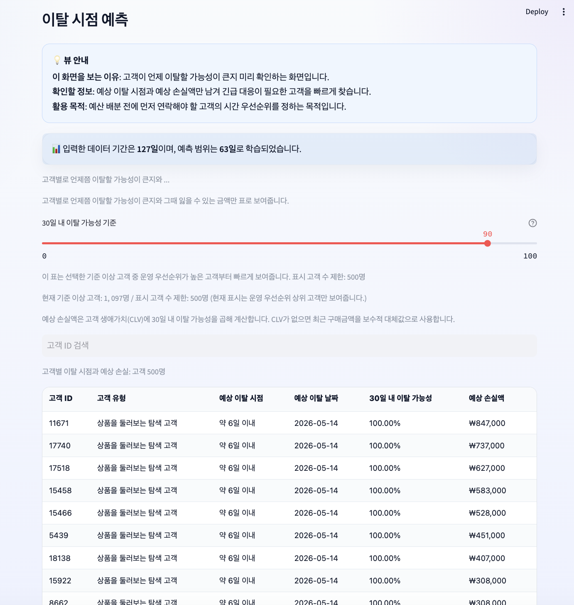
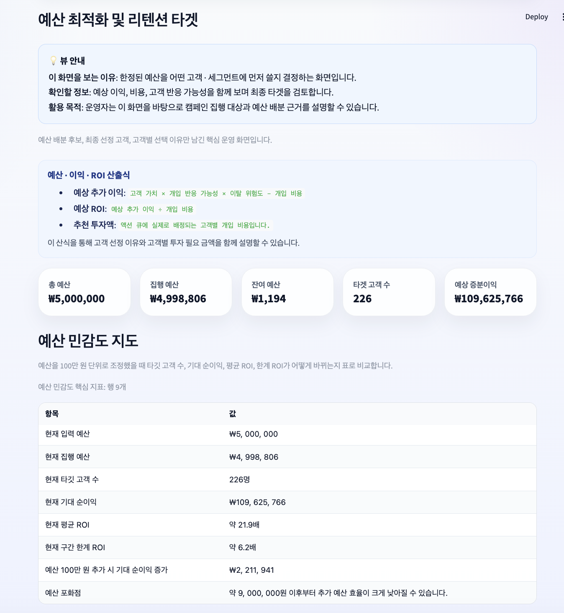
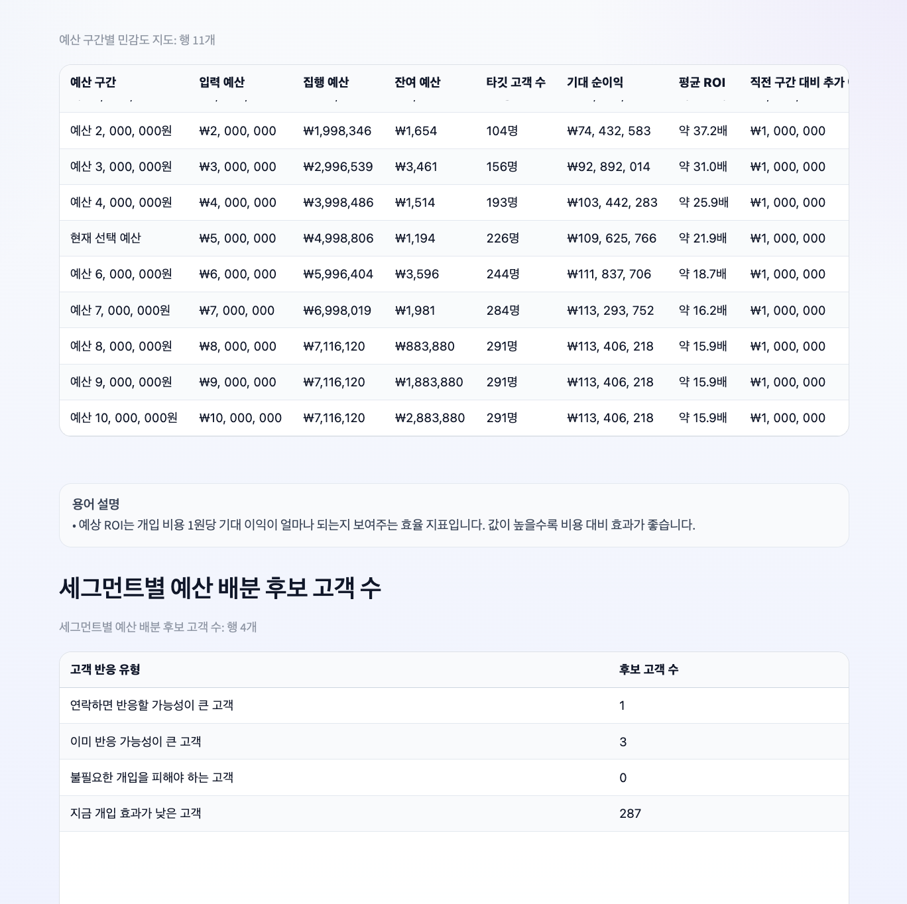
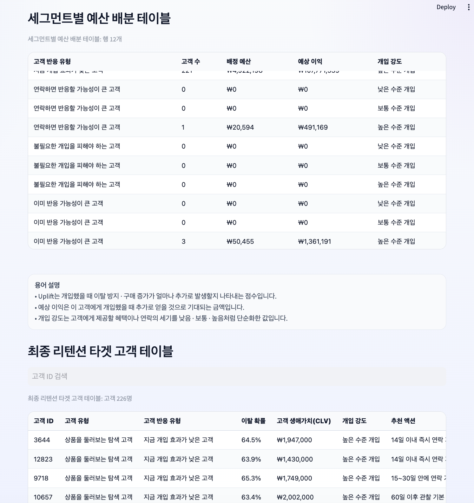
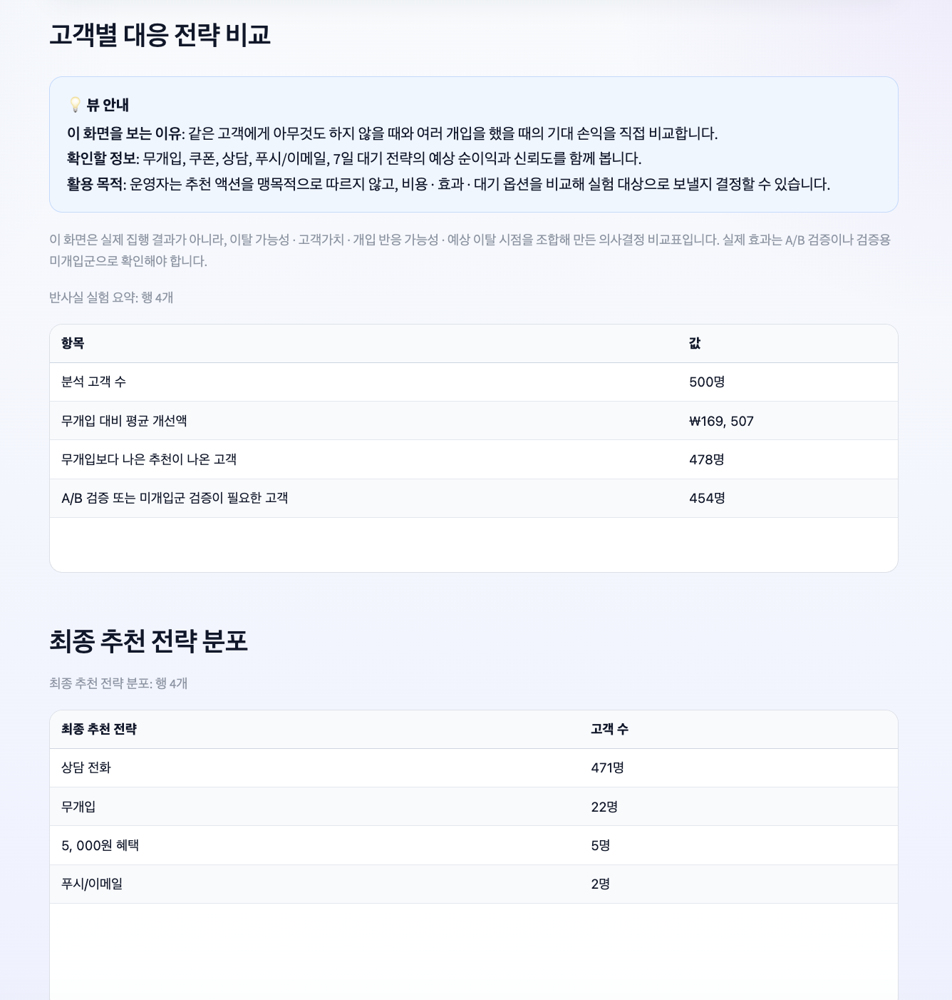
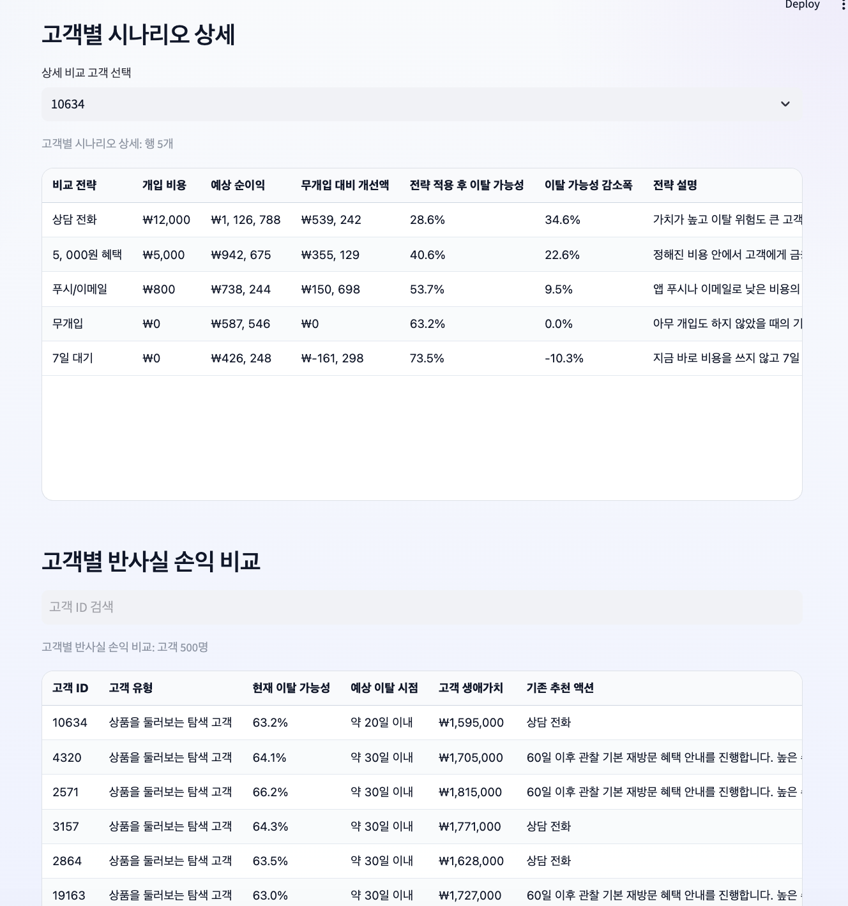
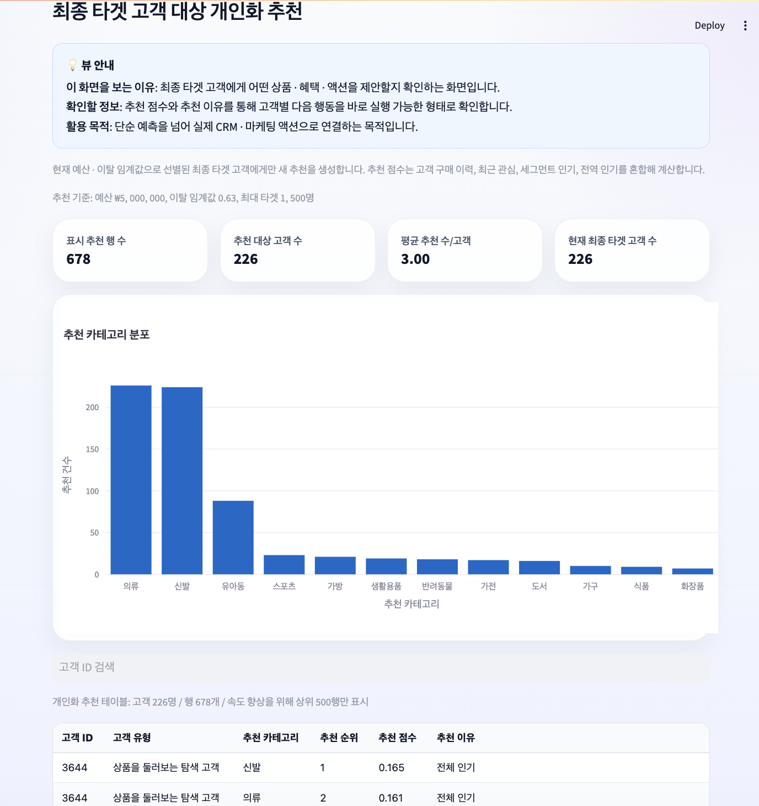
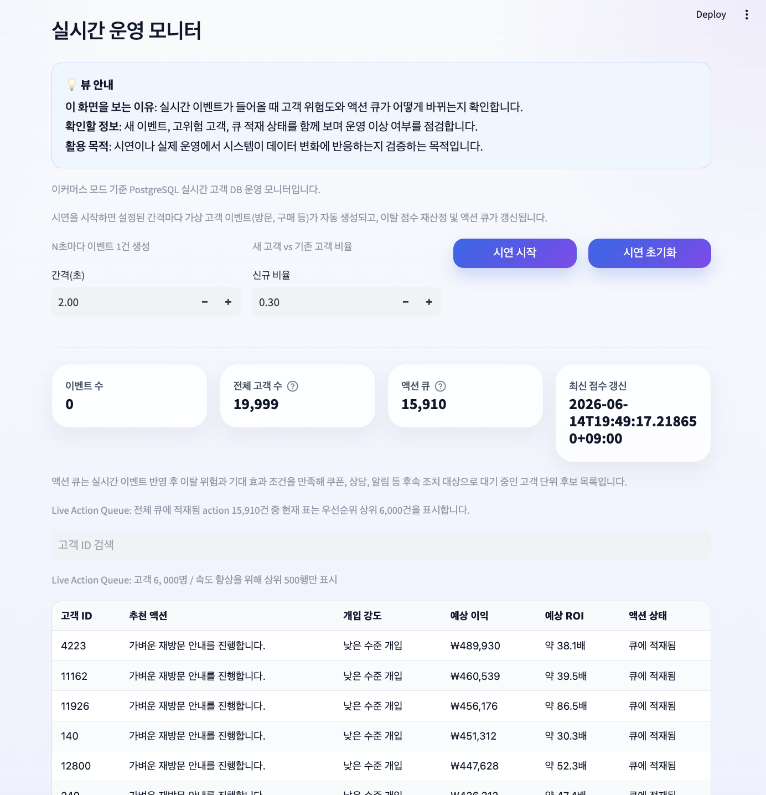
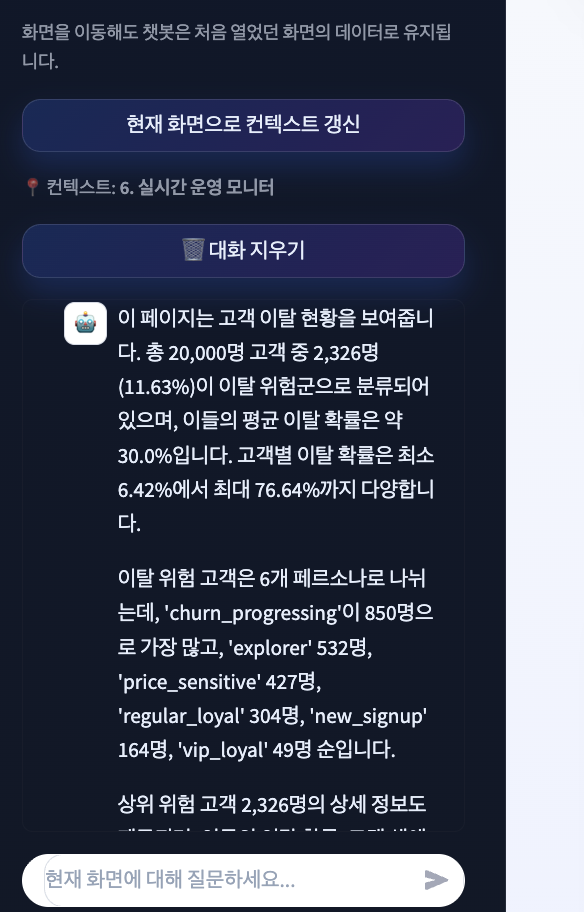

<div align="center">

# Retention ROI Agent

**gRPC + OpenMP 기반 분산 리텐션 ROI 의사결정 플랫폼**

이탈 예측을 넘어, 리텐션 예산을 **어디에·언제·어떤 방식으로 써야 하는지** 계산하는 운영형 Retention Intelligence Copilot입니다.  
CSV/TSV 파일 하나를 업로드하면 고객 이탈 위험, 예상 이탈 시점, 개입 효과, 고객 가치, 예산 제약, 개인화 액션, 실시간 액션 큐까지 하나의 의사결정 흐름으로 연결합니다.

[데모 영상](https://github.com/user-attachments/assets/a8b620c8-00bd-4ce2-9d33-da98e79b3fe2) · [차별화 전략](docs/product_differentiation.md) · [대시보드 의사결정 루프](docs/dashboard_decision_loop.md) · [의사결정 로직](docs/decision_logic.md) · [기술 문서](docs/technical_guide.md) 

</div>

---

## 기술적 핵심 요약

이 프로젝트는 단순한 churn dashboard가 아니라, **분산 처리·병렬 계산·실시간 운영 큐·의사결정 최적화**를 결합한 end-to-end retention decision system입니다.

| 영역 | 기술 스택 / 설계 |
| --- | --- |
| 프론트엔드 대시보드 | CSV 온보딩, 리텐션 분석, ROI 시뮬레이션, 액션 큐 모니터링을 위한 Streamlit 대시보드 |
| 백엔드 API | 데이터 수집, 예측, 최적화, 라이브 이벤트 처리를 위한 FastAPI 기반 API 서버 |
| 분산 미들웨어 | 피처 계산과 ROI 스코어링 서비스를 분리하기 위한 gRPC 워커 구조 |
| 병렬 컴퓨팅 | 고객 단위 병렬 계산을 위한 OpenMP C++ ROI 스코어링 커널 |
| 로드 밸런싱 | 확장 가능한 API replica 앞단의 Nginx reverse proxy |
| 데이터 계층 | PostgreSQL live DB, Redis cache / queue 지원 |
| ML / Analytics | 이탈 예측, 생존 분석, uplift-style scoring, CLV 추정, 예산 최적화 |
| 배포 | Docker Compose 기반 멀티 서비스 환경 |
| 평가 | API 수준 동시성 벤치마크, 처리량 / 지연시간 측정, OpenMP 확장 경로 |

---

## 시스템 아키텍처

```text
Browser / Streamlit Dashboard
        |
        v
Nginx API Load Balancer
        |
        v
FastAPI API Replicas
        |
        +----------------------------+
        |                            |
        v                            v
PostgreSQL / Redis           gRPC Feature Worker
                                      |
                                      v
                              gRPC ROI Worker
                                      |
                                      v
                              OpenMP C++ ROI Kernel
                                      |
                                      v
                         Retention ROI / Action Decision
```

이 플랫폼은 사용자 인터랙션, API 오케스트레이션, 피처 계산, ROI 스코어링을 분리합니다.  
이 구조는 단일 대시보드 중심의 모놀리식 churn application보다 확장, 벤치마크, 기능 고도화가 쉽습니다.

---

## 이 프로젝트가 다른 점

대부분의 churn analytics 도구는 다음 질문에서 멈춥니다.

> “누가 이탈할 가능성이 높은가?”

Retention ROI Agent는 한 단계 더 나아가 다음을 묻습니다.

> “이 고객을 붙잡는 것이 경제적으로 타당한가, 어떤 액션을 취해야 하는가, 언제 개입해야 하는가, 그리고 제한된 리텐션 예산을 어떻게 배분해야 하는가?”

| 기존 솔루션 | 한계 | Retention ROI Agent |
| --- | --- | --- |
| Churn prediction notebooks | 모델 점수와 feature importance에 집중 | 이탈 위험을 리텐션 ROI 의사결정으로 변환 |
| BI dashboards | 상태를 보여주지만 액션을 최적화하지 않음 | 제약 조건에 따라 타깃, 예산, 액션, ROI를 재계산 |
| CRM campaign tools | 캠페인은 실행하지만 한계 ROI를 판단하지 않음 | 예상 증분 이익 기준으로 고객을 랭킹화 |
| Product analytics tools | 퍼널과 행동을 분석 | 이벤트 로그를 고객 단위 리텐션 의사결정으로 변환 |
| AutoML PoCs | 예측 정확도 최적화에 집중 | 예측, 액션, 비용, 타이밍, 라이브 운영을 통합 |

---

## 핵심 제품 기능

### 1. 산업군 인식 CSV / TSV 온보딩

플랫폼은 금융 및 이커머스 유형의 데이터셋을 모두 지원합니다.

- 금융 모드: 예금, 대출, 카드 거래, 잔고 변화, 연체, 상담 이력
- 이커머스 모드: 방문, 검색, 장바구니, 구매, 쿠폰, 카테고리 선호

업로드된 데이터는 표준화된 내부 이벤트 스키마로 자동 매핑됩니다.



---

### 2. 자동 스키마 매핑 및 이벤트 표준화

데이터셋마다 컬럼명이 다르기 때문에, 플랫폼은 고객 ID, timestamp, event type, monetary amount, category, churn label 후보를 감지한 뒤 내부 스키마로 정규화합니다.


---

### 3. 이탈 현황 및 세그먼트 단위 진단

대시보드는 전체 고객 수, 고위험 고객 수, 고위험 비율, 평균 이탈 확률을 요약합니다.  
이는 생존 분석, uplift, CLV, 예산 분석으로 들어가기 전 운영 판단의 출발점 역할을 합니다.


---

### 4. 생존 분석 기반 이탈 시점 예측

시스템은 예상 이탈 시점과 다음과 같은 개입 구간을 추정합니다.

- 14일 이내 즉시 접촉
- 15~30일 이내 계획 접촉
- 31~60일 이내 저긴급 접촉



---

### 5. 예산 배분 및 한계 ROI 최적화

총예산, 이탈 임계값, 최대 타깃 고객 수가 주어지면 시스템은 다음 항목을 재계산합니다.

- 예산 제약 내 최종 타깃 고객
- 세그먼트 단위 예산 배분
- 예상 증분 이익
- 추가 예산의 한계 ROI
- 예산 포화 구간 및 저효율 예산 구간
- 과도한 비용 집중을 방지하기 위한 고강도 액션 상한







---

### 6. Counterfactual Retention Lab

선택한 고객에 대해 플랫폼은 여러 개입 시나리오를 비교합니다.

- 액션 없음
- 쿠폰 / 금전 혜택
- 상담 전화
- Push / email
- 7일 대기

추천 결과는 단순히 하나의 액션을 고르는 데 그치지 않고, 대안들과의 경제적 비교까지 함께 제공합니다.





---

### 7. 최종 타깃 대상 개인화 추천

개인화 추천은 현재 예산, 이탈 임계값, 타깃 제한 조건 아래 최종 선정된 고객에게만 생성됩니다.  
랭킹은 개인 이력, 최근 관심 신호, 유사 세그먼트 선호, 전체 인기 신호를 결합합니다.



---

### 8. 라이브 운영 모니터 및 액션 큐

새 이벤트가 PostgreSQL live DB에 유입되면, 시스템은 고객 상태, 이탈 점수, 추천 후보, expected-ROI 기반 액션 큐를 업데이트합니다.

- FastAPI 이벤트 수집
- 고객 피처 상태 업데이트
- Churn / CLV / uplift 재스코어링
- Expected ROI 액션 큐 삽입
- 실시간 시뮬레이션을 위한 데모 이벤트 스트림



---

### 9. 컨텍스트 인식 AI 어시스턴트

LLM 어시스턴트는 전체 데이터베이스를 무작정 읽는 방식이 아니라, 현재 대시보드 상태를 기반으로 질문에 답합니다.  
사용자는 다음과 같은 질문을 할 수 있습니다.

- “이 세그먼트가 왜 위험한가?”
- “예산을 늘리면 무엇이 달라지는가?”
- “어떤 고객에게 먼저 연락해야 하는가?”



---

## 분산 및 병렬 실행 경로

리텐션 의사결정 파이프라인은 장난감 벤치마크가 아니라 플랫폼 백엔드에 통합되어 있습니다.

```text
CSV Upload / Optimization Request
  -> FastAPI API
  -> gRPC Feature Worker
  -> gRPC ROI Worker
  -> OpenMP C++ ROI Kernel
  -> Ranked retention decisions
  -> Dashboard response
```

### gRPC 워커 분리

피처 계산과 ROI 스코어링은 별도 워커 서비스로 분리되어 있습니다.  
이를 통해 백엔드는 더 쉽게 확장될 수 있으며, 무거운 계산 작업을 사용자-facing API replica와 분리할 수 있습니다.

### OpenMP ROI 스코어링

고객 단위 ROI 스코어링은 각 고객의 예상 증분 이익을 독립적으로 계산할 수 있기 때문에 병렬화에 적합합니다.  
ROI worker는 대규모 고객 배치의 스코어링 속도를 높이기 위해 C++ OpenMP 커널에 계산을 위임합니다.

### API 로드 밸런싱

Nginx는 FastAPI 서비스 앞단에 위치하며, 여러 API replica가 대시보드 및 최적화 요청을 처리할 수 있도록 합니다.

```bash
docker compose up -d --build --scale api=2
```

이는 트래픽 처리, 수평 확장, 동시성 테스트를 위한 실용적인 경로를 제공합니다.

---

## 의사결정 흐름

```text
CSV / TSV Upload
  -> Column role detection
  -> Event normalization
  -> Churn label configuration
  -> Churn / Survival / Uplift / CLV computation
  -> gRPC feature processing
  -> OpenMP ROI scoring
  -> Budget-constrained target selection
  -> Personalized recommendation
  -> PostgreSQL live DB seeding
  -> Live event ingestion
  -> Score and action queue update
```

핵심 로직은 단순 예측 질문이 아니라 실제 운영 질문에 답하도록 설계되어 있습니다.

| 질문 | 계산 결과 |
| --- | --- |
| 누가 위험한가? | 이탈 확률, 위험 세그먼트 |
| 언제 개입해야 하는가? | 예상 이탈 시점, 긴급도, 개입 구간 |
| 리텐션이 경제적으로 타당한가? | CLV, 예상 손실, 예상 증분 이익 |
| 누가 설득 가능한가? | Uplift-style score, 설득 가능 세그먼트 |
| 얼마를 써야 하는가? | 액션 비용, 예산 배분, 한계 ROI |
| 무엇을 해야 하는가? | 추천 액션, 개입 강도, next best recommendation |
| 라이브 큐에 넣어야 하는가? | 라이브 점수, expected ROI, 액션 큐 상태 |

---

## 지원 도메인

| 모드 | 산업군 | 예시 데이터 | 주요 의사결정 |
| --- | --- | --- | --- |
| 금융 모드 | 은행, 카드, 핀테크, 보험, 자산관리 | 거래, 잔고, 대출, 상환, 연체, 상담 로그 | 계좌 해지 / 휴면 위험, 상담 우선순위, 상품 추천 |
| 이커머스 모드 | 온라인 쇼핑, 구독 커머스, 마켓플레이스 | 방문, 검색, 장바구니, 구매, 쿠폰, 카테고리 선호 | 재구매 타깃팅, 쿠폰 전략, 카테고리 추천, CRM 큐 |

---

## 빠른 시작

```bash
# 1. 서비스 빌드 및 실행
docker compose up -d --build

# 2. 대시보드 열기
open http://localhost:8501
```

로드 밸런서 뒤의 API replica를 확장하려면 다음 명령어를 사용합니다.

```bash
docker compose up -d --build --scale api=2
```

플랫폼 수준의 벤치마크를 실행하려면 다음 명령어를 사용합니다.

```bash
python scripts/benchmark_parallel_distributed.py
```

---

## 저장소 구조

```text
.
├── src/
│   ├── api/                    # FastAPI 백엔드
│   ├── dashboard/              # Streamlit 대시보드
│   ├── distributed/            # gRPC client / worker 통합
│   ├── hpc/                    # OpenMP C++ ROI 커널
│   ├── optimization/           # 예산 및 ROI 최적화 로직
│   ├── models/                 # Churn / CLV / survival modeling
│   └── realtime/               # Live DB 및 action queue 처리
├── deploy/
│   └── nginx.conf              # API 로드 밸런서 설정
├── scripts/
│   ├── build_openmp_roi.sh
│   └── benchmark_parallel_distributed.py
├── docs/
├── assets/
├── docker-compose.yml
├── Dockerfile.api
└── requirements.txt
```

---

## 입증한 기술 역량

- 업로드부터 액션 큐까지 이어지는 end-to-end ML product design
- FastAPI 백엔드 서비스 설계
- Streamlit 분석 대시보드 개발
- gRPC 기반 분산 워커 아키텍처
- OpenMP C++ 병렬 계산 통합
- 수평 확장 가능한 API replica를 위한 Nginx load balancing
- Docker Compose 멀티 서비스 배포
- PostgreSQL 기반 live operational state
- Redis-compatible cache / queue architecture
- Retention ROI, CLV, uplift-style decision modeling
- 예산 제약 최적화
- API 수준 벤치마크 및 latency / throughput 평가
- 분산 엔진에서 legacy computation path로 이어지는 실용적 fallback 설계

---

## 문서

| 문서 | 설명 |
| --- | --- |
| [차별화 전략](docs/product_differentiation.md) | Churn dashboard, CRM tool, CDP, BI tool과의 차별점 |
| [대시보드 의사결정 루프](docs/dashboard_decision_loop.md) | 대시보드 화면들이 하나의 의사결정 workflow로 연결되는 방식 |
| [의사결정 로직](docs/decision_logic.md) | 예산 최적화, counterfactual analysis, recommendation, live action queue |
| [기술 문서](docs/technical_guide.md) | 설치, API, 저장소 구조, validation checklist |
| [분석 과정](docs/analysis_process.md) | 모델링, 생존 분석, live deployment 흐름 |
| [피처 사전](docs/feature_dictionary.md) | Feature 정의와 의미 |
| [리텐션 전략](docs/retention_strategy.md) | 세그먼트 단위 리텐션 전략 및 비용 / 효과 가정 |
| [Counterfactual Lab](docs/counterfactual_retention_lab.md) | 리텐션 액션별 expected profit 비교 |
| [발표 자료](docs/presentation.pdf) | 프로젝트 발표 자료 |

---

## 프로젝트 포지셔닝

Retention ROI Agent는 리텐션 운영을 위한 decision intelligence system으로 포지셔닝됩니다.  
예측 모델링, 고객 가치 추정, 예산 인식 액션 선택, 분산 백엔드 실행, 실시간 운영 모니터링을 하나의 workflow로 결합합니다.

목표는 단순히 churn을 예측하는 것이 아니라, 다음 질문에 답하는 것입니다.

> “제한된 예산과 운영 역량이 있을 때, 어떤 고객을 먼저 붙잡아야 하며, 어떤 액션을 취해야 하고, 그 이유는 무엇인가?”
